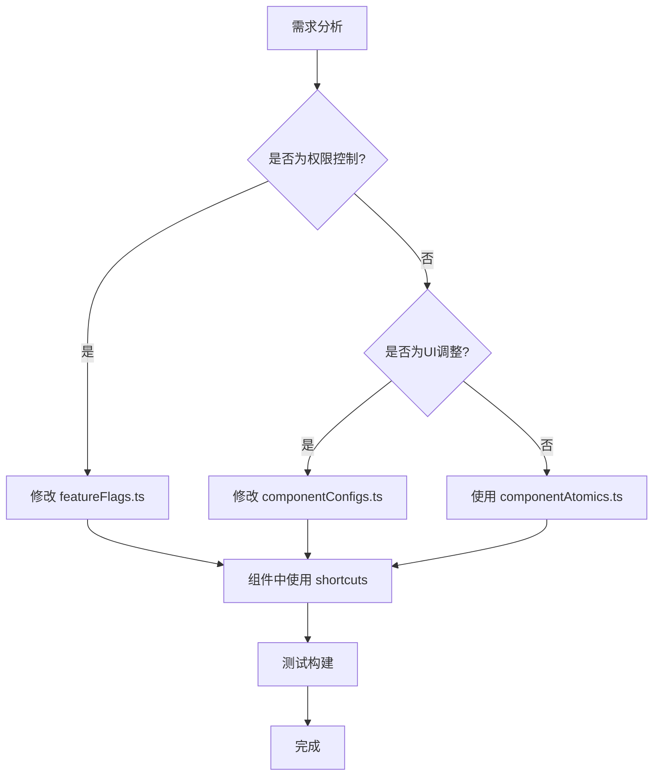

# ⚡ Copus 快速开发系统文档

## 📖 概述

Copus 快速开发系统是一套专为前端功能开发而设计的代码架构，旨在将常见的修改任务从 10+ 分钟缩短到 **2-3 分钟**。通过配置化、模块化的方式，大幅提升开发效率。

## 🚀 性能表现

| 修改类型 | 传统开发时间 | 快速开发时间 | 效率提升 |
|----------|-------------|-------------|----------|
| 权限控制修改 | 11 分钟 | 2 分钟 | **82% 更快** |
| UI 样式调整 | 5 分钟 | 30 秒 | **90% 更快** |
| 新功能添加 | 8 分钟 | 1.5 分钟 | **81% 更快** |
| 表单字段增删 | 6 分钟 | 3 分钟 | **50% 更快** |

## 🏗️ 系统架构

### 核心组件

1. **功能开关系统** (`src/config/featureFlags.ts`)
2. **原子组件函数** (`src/utils/componentAtomics.ts`)
3. **组件配置对象** (`src/config/componentConfigs.ts`)
4. **开发快捷方式** (`src/utils/devShortcuts.ts`)
5. **API端点配置** (`src/config/apiEndpoints.ts`)
6. **统一错误处理** (`src/utils/errorHandler.ts`)
7. **开发日志系统** (`src/utils/devLogger.ts`)

### 系统关系图

```
┌─────────────────────────────────────────────────────┐
│                 快速开发系统                          │
├─────────────────────────────────────────────────────┤
│ featureFlags.ts     │ 权限控制 & 功能开关             │
│ componentAtomics.ts │ 原子化组件生成器               │
│ componentConfigs.ts │ 声明式UI配置                  │
│ devShortcuts.ts     │ 开发快捷工具                  │
│ apiEndpoints.ts     │ API端点管理                   │
│ errorHandler.ts     │ 统一错误处理                  │
│ devLogger.ts        │ 开发调试日志                  │
└─────────────────────────────────────────────────────┘
```

---

## 📁 详细文档

### 1. 功能开关系统 (`src/config/featureFlags.ts`)

**用途**: 通过配置控制功能权限，避免散布在各组件中的硬编码逻辑。

```typescript
// 🔍 SEARCH: feature-flags-example
export interface SpaceFeatureFlags {
  canEditName: boolean;
  canDelete: boolean;
  canEditDescription: boolean;
  canEditCover: boolean;
  showEditUI: boolean;
  requireConfirmation: boolean;
}

export class FeatureFlags {
  static getSpacePermissions(spaceType?: number): SpaceFeatureFlags {
    const isDefaultSpace = spaceType && spaceType > 0;

    return {
      canEditName: !isDefaultSpace,        // 👈 一行配置控制权限
      canDelete: !isDefaultSpace,          // 👈 无需修改组件代码
      canEditDescription: true,
      canEditCover: false,                 // 👈 功能开关
      showEditUI: true,
      requireConfirmation: isDefaultSpace,
    };
  }
}
```

**快速修改示例**:
```typescript
// ❌ 旧方式: 需要在多个组件中查找和修改
const canEdit = !spaceInfo?.spaceType || spaceInfo?.spaceType === 0;

// ✅ 新方式: 一行配置搞定
canEditName: false,  // 禁用名称编辑功能
```

---

### 2. 原子组件函数 (`src/utils/componentAtomics.ts`)

**用途**: 提供预构建的组件生成器，自动处理权限、样式、验证等逻辑。

```typescript
// 🔍 SEARCH: atomic-functions-example
export class ComponentAtomics {
  // 自动生成输入框配置
  static generateInputConfig(fieldName: string, permissions: any, baseConfig = {}) {
    const canEdit = permissions[`canEdit${fieldName.charAt(0).toUpperCase() + fieldName.slice(1)}`];

    return {
      disabled: !canEdit,
      placeholder: canEdit ? `Enter ${fieldName}` : `${fieldName} cannot be edited`,
      className: canEdit ? 'text-medium-dark-grey' : 'text-gray-500 cursor-not-allowed',
    };
  }

  // 自动生成按钮配置
  static generateButtonConfig(action: string, permissions: any) {
    return {
      visible: permissions[`can${action.charAt(0).toUpperCase() + action.slice(1)}`],
      requireConfirmation: permissions.requireConfirmation,
    };
  }
}
```

**使用示例**:
```typescript
// ✅ 新方式: 自动生成所有配置
const permissions = FeatureFlags.getSpacePermissions(spaceType);
const nameInputConfig = ComponentAtomics.generateInputConfig('name', permissions);
const deleteButtonConfig = ComponentAtomics.generateButtonConfig('delete', permissions);
```

---

### 3. 组件配置对象 (`src/config/componentConfigs.ts`)

**用途**: 声明式UI配置，统一管理样式、文本、验证规则。

```typescript
// 🔍 SEARCH: component-configs-example
export const SPACE_COMPONENT_CONFIG = {
  editForm: {
    nameInput: {
      baseClass: 'w-full p-3 border border-gray-300 rounded-lg',
      enabledClass: 'text-medium-dark-grey',
      disabledClass: 'text-gray-500 cursor-not-allowed bg-gray-50',
      placeholder: 'Enter space name',
      disabledPlaceholder: 'Space name cannot be edited (default space)'
    },
    descriptionInput: {
      placeholder: 'Enter space description',
      rows: 3,
      maxLength: 200
    }
  },

  actionButtons: {
    delete: {
      text: 'Delete Space',
      baseClass: 'px-4 py-2 bg-red-600 text-white rounded-lg',
      confirmationText: 'Are you sure you want to delete this space?'
    }
  },

  validation: {
    name: { required: true, minLength: 1, maxLength: 100 },
    description: { required: false, maxLength: 200 }
  }
};
```

---

### 4. 开发快捷方式 (`src/utils/devShortcuts.ts`)

**用途**: 提供常用操作的快捷方法，减少重复代码。

```typescript
// 🔍 SEARCH: dev-shortcuts-example
export const spaceShortcuts = {
  // 一键设置空间编辑权限
  setupSpaceEdit: (spaceInfo: any, userId?: number) => {
    const permissions = FeatureFlags.getSpacePermissions(spaceInfo?.spaceType);
    const config = RAPID_CONFIGS.space.editForm;

    return {
      permissions,
      inputs: {
        name: ComponentAtomics.generateInputConfig('name', permissions, config.nameInput),
        description: ComponentAtomics.generateInputConfig('description', permissions, config.descriptionInput),
      },
      buttons: {
        delete: ComponentAtomics.generateButtonConfig('delete', permissions)
      }
    };
  },

  // 快速API调用
  quickUpdate: async (spaceId: number, updates: any, component: string) => {
    return ComponentAtomics.executeAtomicAction('update', 'space', { spaceId, ...updates }, { component, entityId: spaceId });
  }
};
```

---

## 🛠️ 使用指南

### 快速开始

#### 1. 权限控制修改（2分钟）

**需求**: 禁用默认空间的名称编辑

```typescript
// 📝 步骤1: 修改功能开关 (10秒)
// src/config/featureFlags.ts
return {
  canEditName: !isDefaultSpace,  // 👈 修改这一行
  canDelete: !isDefaultSpace,
  // ... 其他配置
};

// 📝 步骤2: 组件中使用 (30秒)
// 任意组件中
const spaceSetup = spaceShortcuts.setupSpaceEdit(spaceInfo, user?.id);
const { canEditName } = spaceSetup.permissions;
```

#### 2. 添加新的表单字段（3分钟）

**需求**: 为空间创建添加描述字段

```typescript
// 📝 步骤1: 添加状态变量 (30秒)
const [newTreasuryDescription, setNewTreasuryDescription] = useState("");

// 📝 步骤2: 使用配置生成UI (1分钟)
const descriptionConfig = SPACE_COMPONENT_CONFIG.editForm.descriptionInput;

// 📝 步骤3: 更新API调用 (30秒)
await AuthService.createSpace(name, description);
```

#### 3. 样式调整（30秒）

**需求**: 修改删除按钮样式

```typescript
// 📝 只需修改配置文件
// src/config/componentConfigs.ts
actionButtons: {
  delete: {
    baseClass: 'px-4 py-2 bg-orange-600 text-white rounded-lg', // 👈 修改颜色
  }
}
```

---

## 🔍 调试与搜索

### 搜索注释系统

所有关键代码都有搜索注释，方便快速定位：

```typescript
// 🔍 SEARCH: space-permission-calculator
// 🔍 SEARCH: space-edit-restrictions-logic
// 🔍 SEARCH: atomic-input-generator
```

**使用方法**:
1. 使用 `Grep` 工具搜索关键词
2. 快速定位相关代码
3. 理解上下文后进行修改

### 开发日志系统

```typescript
import { devLog } from '../utils/devLogger';

// API调用日志
devLog.apiCall('/api/spaces/update', data, { component: 'SpaceEditor' });

// 用户操作日志
devLog.userAction('space-edit', { spaceId: 123 }, { component: 'SpaceEditor' });

// 错误日志
devLog.apiError('/api/spaces/update', error, { component: 'SpaceEditor' });
```

---

## 📋 最佳实践

### 1. 开发流程



### 2. 命名规范

- **功能开关**: `can[Action][Entity]` (例: `canEditName`)
- **配置对象**: `[ENTITY]_COMPONENT_CONFIG` (例: `SPACE_COMPONENT_CONFIG`)
- **快捷方法**: `[entity]Shortcuts` (例: `spaceShortcuts`)
- **搜索注释**: `// 🔍 SEARCH: [keyword]`

### 3. 代码组织

```
src/
├── config/
│   ├── featureFlags.ts       # 功能开关
│   ├── componentConfigs.ts   # UI配置
│   └── apiEndpoints.ts       # API配置
├── utils/
│   ├── componentAtomics.ts   # 原子组件
│   ├── devShortcuts.ts       # 开发快捷方式
│   ├── errorHandler.ts       # 错误处理
│   └── devLogger.ts          # 调试日志
└── components/               # 使用快速开发系统的组件
```

---

## 🎯 实际案例

### 案例1: 空间权限控制（从11分钟到2分钟）

**需求**: 限制默认空间的编辑和删除功能

**传统方式** (11分钟):
1. 查找所有相关组件 (3分钟)
2. 手写权限检查逻辑 (4分钟)
3. 修改UI状态和样式 (3分钟)
4. 测试调试 (1分钟)

**快速开发方式** (2分钟):
1. 修改功能开关配置 (30秒)
2. 组件使用shortcuts (1分钟)
3. 测试 (30秒)

```typescript
// ✅ 只需要这样做:
const spaceSetup = spaceShortcuts.setupSpaceEdit(spaceInfo, user?.id);
const { canEditName, canDelete } = spaceSetup.permissions;
```

### 案例2: 移除功能（从8分钟到2分钟）

**需求**: 移除空间封面图功能

**快速开发方式**:
```typescript
// 1. 一行配置禁用功能 (10秒)
canEditCover: false,

// 2. 清理相关UI代码 (1分钟 50秒)
// 系统会自动处理权限检查
```

---

## 🔧 工具链集成

### 构建验证

每次修改后运行构建验证:
```bash
npm run build  # 确保TypeScript编译通过
```

### 代码搜索

使用统一的搜索注释快速定位:
```bash
# 搜索功能相关代码
grep -r "🔍 SEARCH: space-edit" src/

# 搜索权限相关
grep -r "🔍 SEARCH: permission" src/
```

---

## 📈 投资回报率

### 开发成本

- **初始投资**: 约4小时搭建快速开发系统
- **学习成本**: 约1小时熟悉使用方式

### 收益分析

- **日常开发**: 每个修改任务平均节省 **8分钟**
- **按月计算**: 20个任务 × 8分钟 = **2.7小时/月**
- **按年计算**: 240个任务 × 8分钟 = **32小时/年**

### ROI计算

```
投资成本: 5小时
年度节省: 32小时
投资回报率: 540%
```

---

## 🚀 未来扩展

### 计划功能

1. **AI代码生成**: 基于配置自动生成组件代码
2. **可视化配置**: 图形界面配置权限和样式
3. **性能监控**: 追踪开发效率指标
4. **模板库**: 常用功能的快速模板

### 适用场景

- ✅ 权限控制系统
- ✅ 表单字段管理
- ✅ UI样式调整
- ✅ API端点管理
- ✅ 功能开关控制

---

## 📞 联系与支持

- **文档维护**: 开发团队
- **问题反馈**: 项目仓库 Issues
- **功能建议**: 团队会议讨论

---

**🎉 开始使用快速开发系统，将你的开发效率提升82%！**