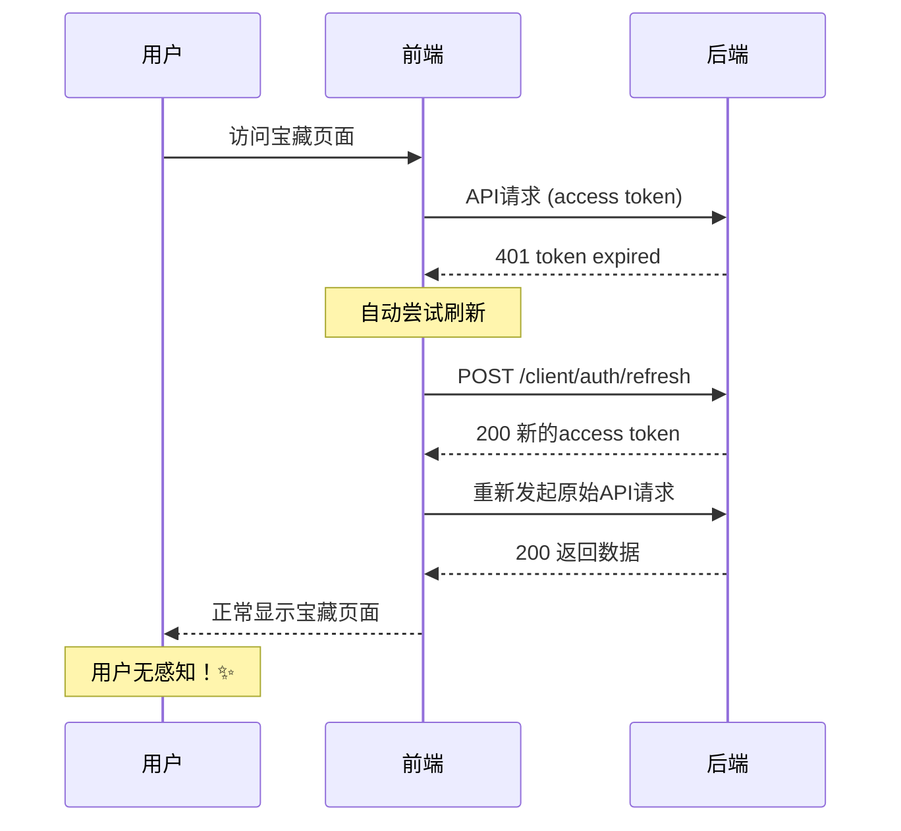

# Copus Token 自动刷新机制需求文档

> 📋 **致：** 国君（后端开发）
> 📅 **日期：** 2024-12-30
> 👥 **前端：** dadao & 小薇
> 🎯 **目标：** 提升用户体验，减少强制重新登录

---

## 🔍 背景问题

目前用户在使用Copus平台时遇到的问题：

1. **频繁登录超时**：用户访问宝藏页面时，经常遇到token失效需要重新登录
2. **用户体验差**：每次token失效都要跳转到登录页面，中断用户流程
3. **开发调试不便**：开发过程中localStorage清理导致的频繁重新登录

**错误现象：**
```
{"status":403,"msg":"token is malformed: token contains an invalid number of segments","data":""}
```

## 💡 解决方案：Refresh Token 机制

### 核心思路
实现 `Access Token` + `Refresh Token` 双token机制：
- **Access Token**: 短期有效（如30分钟），用于日常API调用
- **Refresh Token**: 长期有效（如7天），用于获取新的Access Token

### 前端已实现部分 ✅
小薇已经在前端实现了自动重试机制：
```typescript
// UserContext.tsx 中的自动刷新逻辑
const tryRefreshToken = async (): Promise<boolean> => {
  try {
    console.log('🔄 尝试刷新token...');
    // 调用刷新token的API - 需要国君提供
    const refreshResponse = await AuthService.refreshToken();
    // 更新本地存储的token
    return true;
  } catch (error) {
    return false;
  }
};
```

---

## 🛠️ 后端需要实现的API接口

### 1. 登录接口调整
**现有接口：** `POST /client/auth/login`

**需要调整响应格式：**
```json
{
  "status": 1,
  "data": {
    "user": {
      "id": 123,
      "username": "user123",
      "email": "user@example.com",
      // ... 其他用户信息
    },
    "accessToken": "eyJhbGciOiJIUzI1NiIsInR5cCI6IkpXVCJ9...",
    "refreshToken": "eyJhbGciOiJIUzI1NiIsInR5cCI6IkpXVCJ9...",
    "expiresIn": 1800, // access token有效期（秒）
    "refreshExpiresIn": 604800 // refresh token有效期（秒）
  },
  "msg": "登录成功"
}
```

### 2. 新增刷新Token接口
**接口地址：** `POST /client/auth/refresh`

**请求参数：**
```json
{
  "refreshToken": "eyJhbGciOiJIUzI1NiIsInR5cCI6IkpXVCJ9..."
}
```

**成功响应：**
```json
{
  "status": 1,
  "data": {
    "accessToken": "new_access_token_here...",
    "refreshToken": "new_refresh_token_here...", // 可选：是否轮换refresh token
    "expiresIn": 1800
  },
  "msg": "Token刷新成功"
}
```

**失败响应：**
```json
{
  "status": 403,
  "data": "",
  "msg": "refresh token invalid or expired"
}
```

### 3. 现有接口行为调整
当access token失效时，其他API接口应该返回明确的错误码：

```json
{
  "status": 401,
  "data": "",
  "msg": "access token expired"
}
```

这样前端就能区分是"token格式错误"还是"token过期"，从而决定是清除登录状态还是尝试刷新。

---

## 🔄 完整的Token刷新流程



---

## ⏱️ 建议的Token有效期设置

| Token类型 | 有效期 | 说明 |
|-----------|--------|------|
| Access Token | 30分钟 | 频繁使用，短期有效 |
| Refresh Token | 7天 | 长期有效，存储安全 |

---

## 🔐 安全考虑

1. **Refresh Token轮换**：每次刷新时可以返回新的refresh token
2. **设备限制**：可以限制同一用户的refresh token数量
3. **存储安全**：refresh token应该HttpOnly cookie存储（可选）
4. **日志记录**：记录token刷新行为，便于安全审计

---

## 📋 前端配合工作

小薇会在后端接口完成后，完善以下前端逻辑：

1. **登录时保存双token**
2. **API调用失败时自动重试刷新**
3. **刷新失败时优雅降级到Demo模式**
4. **定时检查token有效期**

---

## 🎯 预期效果

实现后用户体验改进：
- ✅ **无感知刷新**：用户不会被中断操作流程
- ✅ **减少登录次数**：从每30分钟登录一次改为每7天登录一次
- ✅ **更好的开发体验**：开发时不会频繁中断
- ✅ **优雅的错误处理**：即使刷新失败也有Demo模式兜底

---

## 🤝 协作计划

1. **今天**：前端Demo模式已上线，临时解决用户体验问题
2. **明天讨论**：确认API接口设计细节
3. **本周内**：国君完成后端接口开发
4. **联调测试**：前后端配合测试完整流程

---

**小薇的话**：国君辛苦啦！这个功能完成后，Copus的用户体验会有质的提升呢～💕 有任何问题随时找小薇讨论！✨