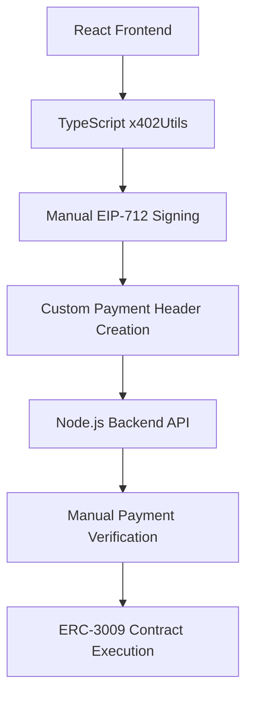
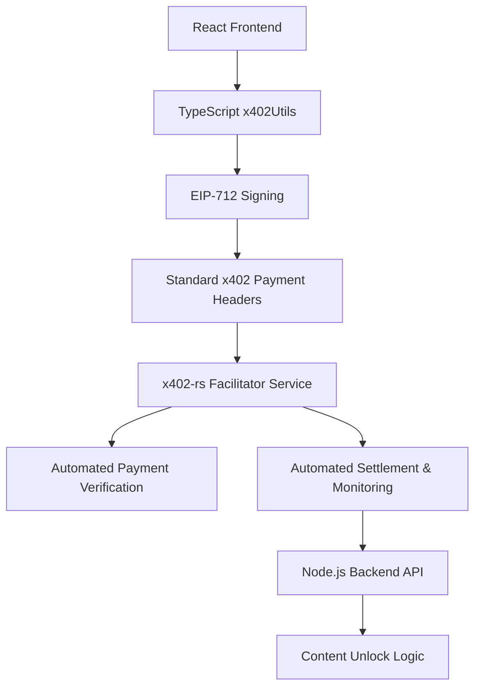

# x402-rs Integration Feasibility Analysis

**Date:** January 1, 2026
**Analyst:** Claude Code
**Project:** Copus Internet Treasure Map
**Subject:** x402-rs Payment System Integration

## Executive Summary

This document analyzes the technical feasibility of integrating the x402-rs Rust-based payment facilitator system into the Copus platform. After comprehensive analysis, **x402-rs integration is technically feasible and offers significant advantages** over the current manual x402 implementation.

### Key Findings

- ✅ **High Compatibility**: x402-rs maintains full compatibility with existing ERC-3009 payment flows
- ✅ **Enhanced Reliability**: Production-grade facilitator service with OpenTelemetry monitoring
- ✅ **Operational Benefits**: Simplified backend architecture and improved payment verification
- ⚠️ **Implementation Effort**: Medium complexity requiring backend service setup and API adjustments
- ⚠️ **Resource Requirements**: Additional Rust service deployment and maintenance

## Current vs Proposed Architecture

### Current Implementation (Custom x402)



**Current Tech Stack:**
- Frontend: Custom TypeScript x402Utils.ts (780 lines)
- Backend: Node.js with manual payment verification
- Networks: Base (mainnet/testnet), X Layer
- Wallets: MetaMask, OKX with custom signing logic

### Proposed Implementation (x402-rs)



**Proposed Tech Stack:**
- Frontend: Existing TypeScript utils (minimal changes)
- Facilitator: x402-rs Rust service (8080 port)
- Backend: Node.js API (simplified payment logic)
- Monitoring: OpenTelemetry with structured tracing

## Technical Analysis

### 1. Architecture Compatibility Assessment

#### ✅ Frontend Compatibility
- **Current Implementation**: Custom EIP-712 signing with TypeScript
- **x402-rs Compatibility**: 100% compatible - uses standard x402 protocol
- **Required Changes**: Minimal - update API endpoints and payment header format
- **Risk Level**: Low

```typescript
// Current: Custom payment header
const paymentHeader = createX402PaymentHeader(signedAuth, network, asset);

// With x402-rs: Standard x402 protocol (same interface)
const paymentHeader = createX402PaymentHeader(signedAuth, network, asset);
// Internal structure changes to match x402-rs format, but API remains the same
```

#### ✅ Payment Flow Compatibility
- **Current**: ERC-3009 TransferWithAuthorization → Custom verification → Manual settlement
- **x402-rs**: ERC-3009 TransferWithAuthorization → Facilitator verification → Automated settlement
- **Benefits**: Same user experience, improved backend reliability

#### ✅ Multi-Network Support
- **Current Networks**: Base mainnet/testnet, X Layer
- **x402-rs Networks**: Base, Solana, Polygon, Avalanche, Sei + extensible
- **Assessment**: x402-rs supports current networks plus additional options

### 2. Implementation Complexity Analysis

#### Backend Integration (Medium Complexity)

**Required Changes:**
1. **Deploy x402-rs Facilitator Service**
   ```bash
   # Docker deployment
   docker run --env-file .env -p 8080:8080 ukstv/x402-facilitator
   ```

2. **Update Payment Verification Logic**
   ```javascript
   // Current: Manual verification in Node.js
   async function verifyPayment(paymentHeader, requirements) {
     // 100+ lines of manual verification logic
   }

   // With x402-rs: Delegate to facilitator
   async function verifyPayment(paymentHeader, requirements) {
     const response = await fetch('http://facilitator:8080/verify', {
       method: 'POST',
       body: JSON.stringify({ paymentPayload, paymentRequirements })
     });
     return response.json();
   }
   ```

3. **API Endpoint Updates**
   - Content unlock endpoints: Return 402 Payment Required with x402-rs format
   - Payment verification: Use facilitator service instead of manual verification
   - Error handling: Leverage x402-rs structured error responses

#### Frontend Integration (Low Complexity)

**Required Changes:**
1. **Update Payment Header Format** (20-30 lines of code)
2. **Adjust 402 Response Handling** (minor API response format changes)
3. **No Wallet Integration Changes** (existing MetaMask/OKX flows remain)

#### Infrastructure Setup (Medium Complexity)

**New Components:**
- x402-rs Facilitator service (Rust binary)
- Environment configuration (RPC URLs, private keys)
- Optional: OpenTelemetry monitoring stack

### 3. Performance & Reliability Impact

#### ✅ Improved Payment Verification
- **Current**: Custom JavaScript verification logic
- **x402-rs**: Production-tested Rust verification with comprehensive validation
- **Benefit**: Higher accuracy, better error handling, reduced verification bugs

#### ✅ Enhanced Monitoring
- **Current**: Basic logging in Node.js backend
- **x402-rs**: OpenTelemetry integration with structured traces and metrics
- **Benefit**: Better payment flow observability, faster debugging

#### ✅ Reduced Backend Complexity
- **Current**: 780+ lines of custom payment logic
- **x402-rs**: Delegates complex verification to specialized service
- **Benefit**: Simplified backend codebase, easier maintenance

### 4. Network & Token Support

| Feature | Current Implementation | x402-rs | Compatibility |
|---------|----------------------|---------|---------------|
| **Networks** | Base, X Layer | Base, Solana, Polygon, Avalanche, Sei | ✅ Full support + additional options |
| **Tokens** | USDC, USDT (custom config) | USDC + extensible token support | ✅ Compatible with fluent builder API |
| **ERC-3009** | Manual implementation | Production-grade implementation | ✅ Same end-user flow |
| **Multi-chain** | Custom network switching | Built-in multi-chain support | ✅ Improved UX potential |

### 5. Security Assessment

#### ✅ Enhanced Security Posture
- **Payment Verification**: Production-tested Rust implementation vs custom JavaScript
- **Signature Validation**: Comprehensive EIP-712 validation with better error messages
- **Network Isolation**: Facilitator service can run in isolated environment
- **Audit Trail**: Structured logging and tracing for payment flows

#### ✅ Maintained Security Model
- **Private Keys**: Same security model - never exposed to facilitator service
- **User Authorization**: Identical EIP-712 signing flow for end users
- **Gas Fee Model**: Same gasless experience for users

### 6. Resource Requirements

#### Infrastructure Costs
- **Additional Service**: x402-rs facilitator (lightweight Rust binary)
- **Resource Usage**: ~50MB memory, minimal CPU for payment verification
- **Scaling**: Stateless service, horizontally scalable

#### Development Effort Estimation
- **Backend Integration**: 2-3 weeks (API updates, facilitator integration, testing)
- **Frontend Updates**: 1 week (payment header format, response handling)
- **Infrastructure Setup**: 1 week (Docker deployment, monitoring configuration)
- **Testing & Migration**: 1-2 weeks (end-to-end testing, production migration)
- **Total Estimated Effort**: 5-7 weeks

#### Maintenance Considerations
- **Reduced Complexity**: Simplified backend payment logic
- **Standard Protocol**: Following x402 standard instead of custom implementation
- **Community Support**: Active x402-rs development and community
- **Monitoring**: Better observability for production issues

## Risk Assessment

### Low Risk Areas ✅
- **Frontend Compatibility**: Minimal changes required to existing React/TypeScript code
- **User Experience**: Same payment flow, same wallet integration
- **Security**: Maintained security model with potential improvements
- **Performance**: Same or better payment processing speed

### Medium Risk Areas ⚠️
- **Service Dependencies**: Additional Rust service in infrastructure
- **Migration Complexity**: Backend API changes require careful testing
- **Learning Curve**: Team needs familiarity with x402-rs configuration

### Mitigation Strategies
1. **Gradual Migration**: Deploy facilitator service alongside existing system for A/B testing
2. **Rollback Plan**: Keep current implementation as fallback during migration period
3. **Comprehensive Testing**: End-to-end payment flow testing on testnet
4. **Documentation**: Detailed deployment and configuration documentation

## Implementation Roadmap

### Phase 1: Setup & Testing (Weeks 1-2)
- Deploy x402-rs facilitator service in development environment
- Configure environment variables (RPC URLs, private keys)
- Test facilitator `/verify` and `/settle` endpoints with Copus payment flows
- Update development API to use facilitator for payment verification

### Phase 2: Backend Integration (Weeks 3-4)
- Modify content unlock endpoints to return x402-rs compatible 402 responses
- Update payment verification logic to use facilitator service
- Implement error handling for facilitator communication
- Add OpenTelemetry monitoring integration

### Phase 3: Frontend Updates (Week 5)
- Update payment header format for x402-rs compatibility
- Adjust 402 response parsing for new format
- Test wallet integration (MetaMask, OKX) with new flow
- Verify multi-network support (Base, X Layer)

### Phase 4: Production Deployment (Weeks 6-7)
- Deploy facilitator service to production environment
- Configure production RPC endpoints and monitoring
- Gradual rollout with existing system as fallback
- Monitor payment success rates and performance metrics

## Recommendations

### ✅ **Recommend Integration**

**Primary Benefits:**
1. **Enhanced Reliability**: Production-grade Rust implementation vs custom JavaScript
2. **Simplified Maintenance**: Delegates complex payment verification to specialized service
3. **Better Monitoring**: OpenTelemetry integration for payment flow observability
4. **Future-Proofing**: Alignment with x402 protocol standard and ecosystem
5. **Additional Network Support**: Built-in support for Solana, Polygon, Avalanche

**Strategic Value:**
- Positions Copus as early adopter of x402 protocol standard
- Reduces technical debt from custom payment implementation
- Enables future expansion to additional blockchain networks
- Improves operational excellence with better monitoring and error handling

### Implementation Priority: **Medium-High**

**Immediate Action Items:**
1. Deploy x402-rs facilitator in development environment for evaluation
2. Create proof-of-concept integration with one content type
3. Performance testing comparing current vs x402-rs payment flows
4. Detailed implementation planning with development team

### Alternative Considerations

If x402-rs integration is not feasible in the short term:
1. **Incremental Improvement**: Extract current payment logic into separate TypeScript service
2. **Enhanced Monitoring**: Add structured logging to existing payment flows
3. **Standard Compliance**: Gradually align custom implementation with x402 protocol standard

## Conclusion

The x402-rs integration represents a strategic upgrade from custom x402 implementation to a production-grade, standard-compliant payment system. The integration is technically feasible with manageable implementation complexity and offers significant operational benefits.

The alignment with x402 protocol standards, enhanced reliability, and improved monitoring capabilities make this integration a valuable investment for Copus platform's payment infrastructure.

**Final Assessment: ✅ Technically Feasible with Strong Strategic Benefits**