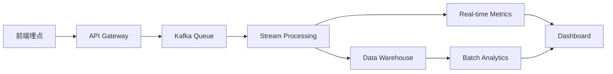

# Copus 数据埋点实施方案

## 📍 埋点实施概览

基于现有的 Copus 平台功能，本文档提供详细的数据埋点实施方案，确保数据驱动的产品优化和运营决策。

## 🎯 埋点 SDK 设计

### 核心 SDK 实现

```typescript
// src/utils/analytics.ts
interface EventData {
  event: string;
  properties: Record<string, any>;
}

interface UserContext {
  user_id?: number;
  session_id: string;
  namespace?: string;
  user_type: 'anonymous' | 'registered';
}

class CopusAnalytics {
  private context: UserContext;
  private queue: EventData[] = [];
  private isInitialized = false;

  constructor() {
    this.context = {
      session_id: this.generateSessionId(),
      user_type: 'anonymous'
    };
  }

  // 初始化
  init(config: { userId?: number; namespace?: string }) {
    if (config.userId) {
      this.context.user_id = config.userId;
      this.context.namespace = config.namespace;
      this.context.user_type = 'registered';
    }
    this.isInitialized = true;
    this.flushQueue();
  }

  // 埋点核心方法
  track(event: string, properties: Record<string, any> = {}) {
    if (!this.isInitialized) {
      this.queue.push({ event, properties });
      return;
    }

    const eventData: EventData = {
      event,
      properties: {
        ...properties,
        ...this.context,
        timestamp: Date.now(),
        page_url: window.location.href,
        page_title: document.title,
        referrer: document.referrer,
        user_agent: navigator.userAgent,
        screen_resolution: `${screen.width}x${screen.height}`,
        viewport_size: `${window.innerWidth}x${window.innerHeight}`,
        timezone: Intl.DateTimeFormat().resolvedOptions().timeZone
      }
    };

    this.send(eventData);
  }

  // 页面访问埋点
  trackPageView(pageName: string, additionalProps: Record<string, any> = {}) {
    this.track('page_view', {
      page_name: pageName,
      ...additionalProps
    });
  }

  // 用户行为埋点
  trackUserAction(action: string, target: string, additionalProps: Record<string, any> = {}) {
    this.track('user_action', {
      action,
      target,
      ...additionalProps
    });
  }

  // 业务事件埋点
  trackBusinessEvent(eventType: string, additionalProps: Record<string, any> = {}) {
    this.track('business_event', {
      event_type: eventType,
      ...additionalProps
    });
  }

  private send(eventData: EventData) {
    // 批量发送优化
    if (this.queue.length > 0) {
      this.queue.push(eventData);
      if (this.queue.length >= 5) {
        this.flush();
      }
    } else {
      this.sendSingle(eventData);
    }
  }

  private async sendSingle(eventData: EventData) {
    try {
      await fetch('/api/analytics/track', {
        method: 'POST',
        headers: {
          'Content-Type': 'application/json',
        },
        body: JSON.stringify(eventData),
      });
    } catch (error) {
      console.warn('Analytics tracking failed:', error);
      // 失败重试机制
      setTimeout(() => this.sendSingle(eventData), 5000);
    }
  }

  private generateSessionId(): string {
    return 'session_' + Date.now() + '_' + Math.random().toString(36).substr(2, 9);
  }

  private flushQueue() {
    while (this.queue.length > 0) {
      const eventData = this.queue.shift()!;
      this.send(eventData);
    }
  }
}

export const analytics = new CopusAnalytics();
```

### 埋点 Hook 封装

```typescript
// src/hooks/useAnalytics.ts
import { useEffect } from 'react';
import { analytics } from '../utils/analytics';
import { useUser } from '../contexts/UserContext';

export const useAnalytics = () => {
  const { user } = useUser();

  useEffect(() => {
    if (user) {
      analytics.init({
        userId: user.id,
        namespace: user.namespace
      });
    }
  }, [user]);

  return analytics;
};

// 页面埋点 Hook
export const usePageTracking = (pageName: string, additionalProps?: Record<string, any>) => {
  const analytics = useAnalytics();

  useEffect(() => {
    analytics.trackPageView(pageName, additionalProps);
  }, [pageName, additionalProps]);
};
```

## 📊 具体页面埋点实施

### Discovery 页面埋点

```typescript
// src/screens/Discovery/Discovery.tsx 修改示例
import { usePageTracking } from '../../hooks/useAnalytics';

export const Discovery = (): JSX.Element => {
  const { isLoggedIn } = useUser();

  // 页面访问埋点
  usePageTracking('discovery', { is_logged_in: isLoggedIn });

  return (
    // ... 现有代码
  );
};
```

### ArticleCard 组件埋点

```typescript
// src/components/ArticleCard/ArticleCard.tsx 修改示例
import { analytics } from '../../utils/analytics';

export const ArticleCard: React.FC<ArticleCardProps> = ({
  article,
  onUserClick,
  layout = 'discovery'
}) => {
  // 文章曝光埋点
  useEffect(() => {
    const observer = new IntersectionObserver(
      ([entry]) => {
        if (entry.isIntersecting) {
          analytics.track('article_impression', {
            article_id: article.id,
            article_title: article.title,
            article_category: article.category,
            author_id: article.userId,
            author_name: article.userName,
            layout_type: layout,
            position: 'feed'
          });
          observer.disconnect();
        }
      },
      { threshold: 0.5 }
    );

    if (cardRef.current) {
      observer.observe(cardRef.current);
    }

    return () => observer.disconnect();
  }, [article, layout]);

  // 文章点击埋点
  const handleArticleClick = () => {
    analytics.trackUserAction('article_click', 'article_card', {
      article_id: article.id,
      article_title: article.title,
      article_category: article.category,
      author_id: article.userId,
      author_name: article.userName,
      layout_type: layout
    });

    // 原有的跳转逻辑
    if (onArticleClick) {
      onArticleClick(article.id);
    }
  };

  // 用户头像点击埋点
  const handleUserClick = () => {
    analytics.trackUserAction('user_profile_click', 'user_avatar', {
      target_user_id: article.userId,
      target_user_name: article.userName,
      target_namespace: article.namespace,
      source_page: 'discovery',
      source_component: 'article_card'
    });

    if (onUserClick) {
      onUserClick(article.userId, article.namespace);
    }
  };

  // 点赞埋点
  const handleLikeClick = () => {
    analytics.trackBusinessEvent('article_like', {
      article_id: article.id,
      article_title: article.title,
      author_id: article.userId,
      is_liked: !isLiked // 假设有状态管理
    });

    // 原有的点赞逻辑
  };

  return (
    // ... JSX 内容，添加相应的点击事件
  );
};
```

### Create 页面埋点

```typescript
// src/screens/Create/Create.tsx 修改示例
export const Create = (): JSX.Element => {
  usePageTracking('create');

  // 开始创作埋点
  useEffect(() => {
    analytics.trackBusinessEvent('create_start');
  }, []);

  // 分类选择埋点
  const handleCategorySelect = (categoryId: number, categoryName: string) => {
    analytics.trackUserAction('category_select', 'category_picker', {
      category_id: categoryId,
      category_name: categoryName,
      page: 'create'
    });

    setSelectedCategory(categoryId);
  };

  // 保存草稿埋点
  const handleSaveDraft = () => {
    analytics.trackBusinessEvent('save_draft', {
      title_length: title.length,
      content_length: content.length,
      has_category: !!selectedCategory,
      has_cover_image: !!coverImage
    });
  };

  // 发布文章埋点
  const handlePublish = () => {
    analytics.trackBusinessEvent('article_publish', {
      title_length: title.length,
      content_length: content.length,
      category_id: selectedCategory,
      has_cover_image: !!coverImage,
      creation_duration: Date.now() - createStartTime
    });
  };

  return (
    // ... JSX 内容
  );
};
```

### 用户认证埋点

```typescript
// src/screens/Login/Login.tsx 修改示例
export const Login = (): JSX.Element => {
  usePageTracking('login');

  const handleLoginAttempt = (email: string) => {
    analytics.track('login_attempt', {
      email_domain: email.split('@')[1],
      login_method: 'email'
    });
  };

  const handleLoginSuccess = (userData: any) => {
    analytics.trackBusinessEvent('login_success', {
      user_id: userData.id,
      user_type: userData.type,
      login_method: 'email'
    });
  };

  const handleLoginFailed = (error: string) => {
    analytics.track('login_failed', {
      error_reason: error,
      login_method: 'email'
    });
  };

  return (
    // ... JSX 内容
  );
};
```

## 🎯 关键业务埋点清单

### 用户生命周期埋点

```typescript
// 1. 用户注册流程
analytics.track('registration_start');
analytics.track('registration_complete', {
  user_id: newUserId,
  registration_duration: completionTime
});

// 2. 用户首次行为
analytics.track('first_page_view', { page_name: 'discovery' });
analytics.track('first_article_click', { article_id: articleId });
analytics.track('first_create_attempt');

// 3. 用户激活事件
analytics.track('user_activated', {
  activation_action: 'first_article_published',
  days_since_registration: daysSinceReg
});
```

### 内容互动埋点

```typescript
// 1. 内容发现
analytics.track('content_search', {
  query: searchTerm,
  result_count: results.length
});

analytics.track('category_browse', {
  category_id: categoryId,
  category_name: categoryName
});

// 2. 内容消费
analytics.track('article_view_start', { article_id: articleId });
analytics.track('article_view_end', {
  article_id: articleId,
  read_duration: duration,
  scroll_depth: scrollPercentage
});

// 3. 内容互动
analytics.track('article_share', {
  article_id: articleId,
  share_method: 'link_copy'
});

analytics.track('comment_post', {
  article_id: articleId,
  comment_length: commentText.length
});
```

### 社交功能埋点

```typescript
// 1. 用户关注
analytics.track('user_follow', {
  target_user_id: targetUserId,
  source_page: 'user_profile'
});

// 2. 通知交互
analytics.track('notification_click', {
  notification_type: 'new_follower',
  notification_id: notificationId
});

// 3. 用户宝藏页面
analytics.track('treasury_visit', {
  treasury_owner_id: ownerId,
  is_own_treasury: isOwnTreasury,
  source: 'user_profile_link'
});
```

## 📈 数据分析指标计算

### 实时指标监控

```sql
-- 实时活跃用户数 (Redis)
ZADD daily_active_users:{date} {timestamp} {user_id}
ZCARD daily_active_users:{date}

-- 实时文章浏览量
INCR article_views:{article_id}
INCR daily_article_views:{date}

-- 实时点赞数
INCR article_likes:{article_id}
SADD article_likers:{article_id} {user_id}
```

### 离线指标计算

```sql
-- 用户留存率计算 (每日批处理)
WITH registration_cohort AS (
  SELECT user_id, DATE(registration_date) as cohort_date
  FROM users
),
user_activity AS (
  SELECT user_id, DATE(event_time) as activity_date
  FROM events
  WHERE event = 'page_view'
)
SELECT
  cohort_date,
  COUNT(DISTINCT r.user_id) as registered_users,
  COUNT(DISTINCT CASE WHEN activity_date = cohort_date + INTERVAL '1 day'
        THEN a.user_id END) as day_1_retained,
  COUNT(DISTINCT CASE WHEN activity_date = cohort_date + INTERVAL '7 day'
        THEN a.user_id END) as day_7_retained
FROM registration_cohort r
LEFT JOIN user_activity a ON r.user_id = a.user_id
GROUP BY cohort_date;
```

## 🔧 技术实施细节

### 数据库设计

```sql
-- 事件表
CREATE TABLE events (
  id BIGINT PRIMARY KEY,
  event_name VARCHAR(100) NOT NULL,
  user_id INT,
  session_id VARCHAR(100) NOT NULL,
  properties JSONB,
  event_time TIMESTAMP DEFAULT CURRENT_TIMESTAMP,
  created_at TIMESTAMP DEFAULT CURRENT_TIMESTAMP
);

-- 索引优化
CREATE INDEX idx_events_user_time ON events(user_id, event_time);
CREATE INDEX idx_events_name_time ON events(event_name, event_time);
CREATE INDEX idx_events_session ON events(session_id);
```

### API 接口设计

```typescript
// 批量事件上报接口
POST /api/analytics/track
{
  "events": [
    {
      "event": "page_view",
      "properties": {
        "page_name": "discovery",
        "user_id": 123,
        "session_id": "session_123",
        "timestamp": 1634567890000
      }
    }
  ]
}

// 实时查询接口
GET /api/analytics/metrics/realtime
{
  "active_users": 1234,
  "page_views_today": 5678,
  "new_articles_today": 89
}
```

### 数据处理流程



## ⚡ 性能优化建议

### 前端优化
- 事件批量发送，减少请求频次
- 使用 Web Workers 处理数据预处理
- 实施采样策略，避免数据过载
- 本地存储失败重试机制

### 服务端优化
- 异步处理事件数据
- 使用 Redis 做实时计算缓存
- 数据分区存储，提高查询效率
- 实施数据生命周期管理

---

*此文档提供了完整的埋点实施方案，可根据实际需求进行调整和扩展。*