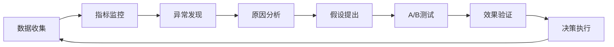

# Copus 数据分析指标体系

## 📊 指标体系概览

本文档建立了 Copus 平台的全面数据分析指标体系，通过北极星指标、关键业务指标和支撑指标三个层次，实现数据驱动的产品运营和优化。

## 🌟 北极星指标

**核心目标**: 构建活跃的内容策展社区

**北极星指标**: 月活跃内容策展用户数 (Monthly Active Content Curators)

- **定义**: 每月至少发布 1 篇内容或收藏 3 篇文章的用户数
- **计算公式**: `COUNT(DISTINCT user_id) WHERE (published_articles >= 1 OR liked_articles >= 3) IN last_30_days`
- **目标意义**: 衡量平台核心价值的实现程度

## 📈 一级指标 (关键业务指标)

### 1. 用户增长指标

#### 1.1 用户获取
```sql
-- 新用户注册数
SELECT COUNT(*) as new_users
FROM users
WHERE DATE(created_at) = CURRENT_DATE;

-- 注册转化率
SELECT
  new_users.count / page_views.count * 100 as conversion_rate
FROM (
  SELECT COUNT(*) as count FROM users WHERE DATE(created_at) = CURRENT_DATE
) new_users,
(
  SELECT COUNT(DISTINCT session_id) as count
  FROM events
  WHERE event_name = 'page_view' AND DATE(event_time) = CURRENT_DATE
) page_views;
```

**关键指标**:
- 日/周/月新增用户数
- 注册转化率 (访问→注册)
- 各渠道获客效果 (搜索、社交、直接访问)
- 获客成本 (CAC)

#### 1.2 用户活跃
```sql
-- 日活跃用户 (DAU)
SELECT COUNT(DISTINCT user_id) as dau
FROM events
WHERE DATE(event_time) = CURRENT_DATE
  AND user_id IS NOT NULL;

-- 用户粘性 (DAU/MAU)
WITH dau AS (
  SELECT COUNT(DISTINCT user_id) as count
  FROM events
  WHERE DATE(event_time) = CURRENT_DATE AND user_id IS NOT NULL
),
mau AS (
  SELECT COUNT(DISTINCT user_id) as count
  FROM events
  WHERE event_time >= CURRENT_DATE - INTERVAL '30 days' AND user_id IS NOT NULL
)
SELECT dau.count / mau.count * 100 as stickiness
FROM dau, mau;
```

**关键指标**:
- 日活跃用户数 (DAU)
- 周活跃用户数 (WAU)
- 月活跃用户数 (MAU)
- 用户粘性 (DAU/MAU)

#### 1.3 用户留存
```sql
-- 次日留存率
WITH cohort AS (
  SELECT user_id, DATE(created_at) as registration_date
  FROM users
  WHERE DATE(created_at) = CURRENT_DATE - INTERVAL '1 day'
),
next_day_active AS (
  SELECT DISTINCT e.user_id
  FROM events e
  JOIN cohort c ON e.user_id = c.user_id
  WHERE DATE(e.event_time) = c.registration_date + INTERVAL '1 day'
)
SELECT
  COUNT(next_day_active.user_id) / COUNT(cohort.user_id) * 100 as day_1_retention
FROM cohort
LEFT JOIN next_day_active ON cohort.user_id = next_day_active.user_id;
```

**关键指标**:
- 次日留存率
- 7日留存率
- 30日留存率
- 留存曲线分析

### 2. 内容生态指标

#### 2.1 内容生产
```sql
-- 日内容发布量
SELECT COUNT(*) as daily_articles
FROM articles
WHERE DATE(created_at) = CURRENT_DATE;

-- 内容创作者比例
SELECT
  COUNT(DISTINCT author_id) / COUNT(DISTINCT user_id) * 100 as creator_ratio
FROM articles a
RIGHT JOIN users u ON a.author_id = u.id
WHERE u.created_at >= CURRENT_DATE - INTERVAL '30 days';
```

**关键指标**:
- 日/周/月内容发布数
- 活跃内容创作者数
- 内容创作者比例
- 平均每用户发布内容数
- 内容质量分布

#### 2.2 内容消费
```sql
-- 内容浏览量
SELECT SUM(view_count) as total_views
FROM articles
WHERE DATE(created_at) = CURRENT_DATE;

-- 平均内容互动率
SELECT
  AVG(like_count / view_count) * 100 as avg_engagement_rate
FROM articles
WHERE view_count > 0
  AND DATE(created_at) >= CURRENT_DATE - INTERVAL '7 days';
```

**关键指标**:
- 内容总浏览量 (PV)
- 独立访客数 (UV)
- 平均停留时间
- 内容互动率 (点赞/收藏/分享)
- 内容完读率

#### 2.3 内容分发效果
```sql
-- 推荐内容点击率
SELECT
  SUM(CASE WHEN source = 'recommendation' THEN clicks END) /
  SUM(CASE WHEN source = 'recommendation' THEN impressions END) * 100 as ctr
FROM content_metrics
WHERE DATE(date) = CURRENT_DATE;
```

**关键指标**:
- 推荐算法点击率 (CTR)
- 各分类内容分发效果
- 热门内容识别准确率
- 个性化推荐效果

### 3. 社交网络指标

#### 3.1 用户关系
```sql
-- 用户关注网络密度
SELECT
  COUNT(*) / (COUNT(DISTINCT follower_id) * COUNT(DISTINCT following_id)) as network_density
FROM user_follows;

-- 平均用户关注数
SELECT AVG(following_count) as avg_following
FROM (
  SELECT follower_id, COUNT(*) as following_count
  FROM user_follows
  GROUP BY follower_id
) t;
```

**关键指标**:
- 用户关注关系总数
- 平均用户关注数/粉丝数
- 用户关注网络密度
- 互关用户比例

#### 3.2 社交活跃度
```sql
-- 社交互动率
SELECT
  COUNT(CASE WHEN event_name IN ('user_follow', 'user_profile_click') THEN 1 END) /
  COUNT(*) * 100 as social_interaction_rate
FROM events
WHERE DATE(event_time) = CURRENT_DATE;
```

**关键指标**:
- 用户资料页访问量
- 关注行为频次
- 社交互动率
- 用户发现路径分析

## 📊 二级指标 (支撑指标)

### 1. 产品功能指标

#### 1.1 发现页面
```sql
-- 发现页面跳出率
WITH page_sessions AS (
  SELECT
    session_id,
    COUNT(*) as page_views,
    MIN(event_time) as first_view,
    MAX(event_time) as last_view
  FROM events
  WHERE event_name = 'page_view'
    AND properties->>'page_name' = 'discovery'
    AND DATE(event_time) = CURRENT_DATE
  GROUP BY session_id
)
SELECT
  COUNT(CASE WHEN page_views = 1 THEN 1 END) / COUNT(*) * 100 as bounce_rate
FROM page_sessions;
```

**关键指标**:
- 发现页面访问量
- 发现页面停留时间
- 内容卡片点击率
- 分类筛选使用率

#### 1.2 创作功能
```sql
-- 创作完成率
SELECT
  COUNT(CASE WHEN event_name = 'article_publish' THEN 1 END) /
  COUNT(CASE WHEN event_name = 'create_start' THEN 1 END) * 100 as creation_completion_rate
FROM events
WHERE DATE(event_time) = CURRENT_DATE;
```

**关键指标**:
- 创作页面访问量
- 创作开始→发布转化率
- 草稿保存率
- 平均创作时长

#### 1.3 宝藏功能
```sql
-- 宝藏页面互动率
SELECT
  COUNT(CASE WHEN event_name = 'article_like' THEN 1 END) /
  COUNT(CASE WHEN event_name = 'page_view' AND properties->>'page_name' = 'treasury' THEN 1 END) * 100 as treasury_engagement
FROM events
WHERE DATE(event_time) = CURRENT_DATE;
```

**关键指标**:
- 宝藏页面访问量
- 宝藏内容点击率
- 跨用户宝藏访问比例
- 宝藏内容收藏率

### 2. 技术性能指标

#### 2.1 页面性能
```sql
-- 平均页面加载时间
SELECT AVG(CAST(properties->>'load_time' AS INTEGER)) as avg_load_time
FROM events
WHERE event_name = 'page_load'
  AND DATE(event_time) = CURRENT_DATE;
```

**关键指标**:
- 页面加载时间 (LCP)
- 首次内容绘制 (FCP)
- 累积布局偏移 (CLS)
- JavaScript 错误率

#### 2.2 API 性能
```sql
-- API 请求成功率
SELECT
  COUNT(CASE WHEN status_code = 200 THEN 1 END) / COUNT(*) * 100 as api_success_rate
FROM api_logs
WHERE DATE(timestamp) = CURRENT_DATE;
```

**关键指标**:
- API 响应时间
- API 成功率
- 数据库查询性能
- CDN 缓存命中率

## 🎯 指标监控体系

### 实时监控指标

```typescript
// 实时监控面板配置
const RealTimeMetrics = {
  // 核心业务指标
  activeUsers: {
    query: "SELECT COUNT(DISTINCT user_id) FROM events WHERE event_time >= NOW() - INTERVAL '1 hour'",
    refreshInterval: 60, // 秒
    threshold: { warning: 100, critical: 50 }
  },

  // 系统健康指标
  errorRate: {
    query: "SELECT COUNT(*) FROM error_logs WHERE timestamp >= NOW() - INTERVAL '5 minutes'",
    refreshInterval: 30,
    threshold: { warning: 10, critical: 50 }
  },

  // 内容活跃度
  contentEngagement: {
    query: "SELECT COUNT(*) FROM events WHERE event_name IN ('article_like', 'article_share') AND event_time >= NOW() - INTERVAL '1 hour'",
    refreshInterval: 300,
    threshold: { warning: 20, critical: 10 }
  }
};
```

### 告警机制

```typescript
// 指标异常告警配置
const AlertRules = [
  {
    name: "用户活跃度异常",
    condition: "DAU下降超过20%",
    severity: "high",
    channels: ["slack", "email"]
  },
  {
    name: "内容发布量异常",
    condition: "日发布量低于历史平均50%",
    severity: "medium",
    channels: ["slack"]
  },
  {
    name: "系统错误率异常",
    condition: "错误率超过5%",
    severity: "critical",
    channels: ["slack", "sms", "email"]
  }
];
```

## 📋 数据报表体系

### 1. 日报 (Daily Report)

**核心指标**:
- DAU 及同比/环比变化
- 新增用户数及转化漏斗
- 内容发布量及质量分布
- 关键异常事件汇总

### 2. 周报 (Weekly Report)

**重点分析**:
- 用户行为模式分析
- 内容热度趋势分析
- 功能使用情况统计
- 运营活动效果评估

### 3. 月报 (Monthly Report)

**深度洞察**:
- 用户生命周期分析
- 内容生态健康度评估
- 产品功能使用深度分析
- 竞品对比分析

### 4. 专题分析报告

**按需生成**:
- 新功能上线效果分析
- 用户画像分析报告
- 内容策略优化建议
- 增长策略分析报告

## 🔄 指标优化方法论

### AARRR 模型应用

**Acquisition (获客)**
- 渠道效果分析
- 获客成本优化
- 品牌认知度提升

**Activation (激活)**
- 新用户引导优化
- 首次使用体验改进
- 激活转化率提升

**Retention (留存)**
- 用户流失原因分析
- 产品粘性功能设计
- 个性化推荐优化

**Revenue (变现)**
- 用户价值分析
- 付费转化路径优化
- 商业模式验证

**Referral (推荐)**
- 病毒传播机制设计
- 社交分享功能优化
- 口碑营销策略

### 数据驱动决策流程



## 🎯 指标优化路线图

### 短期目标 (1-3个月)
- 建立核心指标监控体系
- 完善数据采集和清洗流程
- 建立基础报表和告警机制

### 中期目标 (3-6个月)
- 深度用户行为分析
- 个性化推荐算法优化
- 内容质量评估体系建立

### 长期目标 (6-12个月)
- 预测性分析模型建立
- 智能运营决策系统
- 全链路数据驱动优化

---

*本指标体系将根据业务发展和数据洞察持续迭代优化。*